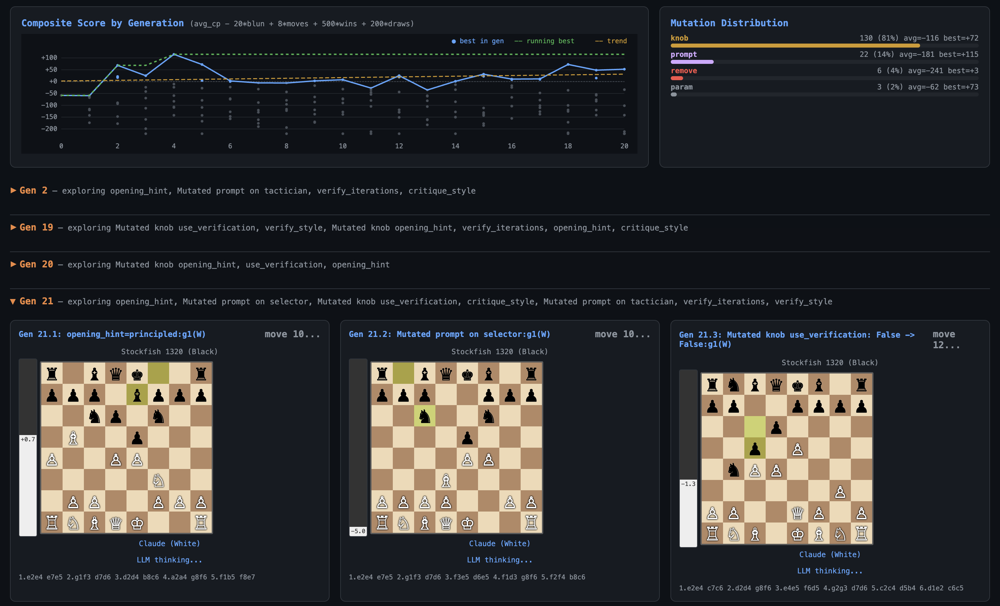

# chess-evolve

[](https://github.com/lambdabaa/chess-evolve/actions/workflows/ci.yml)

Teach an LLM to play chess via evolutionary prompt optimization, powered by [remote-factory](https://github.com/akashgit/remote-factory).



Each chess move runs a composed `Package` pipeline through factory's `WorkflowExecutor`:

```
Sequential(
    Parallel(analyst, tactician, positionalist),
    Loop(Sequential(selector, verifier), gate)
)
```

The outer loop evolves this pipeline using factory's MAP-Elites quality-diversity search:
- `KNOB_MUTATE` tunes verification style, iteration count, and critique approach
- `PROMPT_MUTATE` rewrites agent prompts via Opus (full replacement, not append)
- Contrastive reflection identifies which knobs and prompts drive performance
- Rank-weighted tournament selection biases toward stronger parents

## Quick start

```bash
uv sync
brew install stockfish  # macOS (or apt install stockfish)

# Run the evolution loop
chess-evolve run

# In another terminal, start the live UI
chess-evolve serve
# Open http://localhost:8422
```

## Adapting this to your domain

This demo has two layers: **factory integration** (reusable pattern) and **chess logic** (domain-specific). If you're building something similar for a different domain, here's what to keep, what to replace, and what to study.

### The factory integration pattern (study these)

These files show the pattern you'd follow regardless of domain:

**[`pipeline.py`](src/chess_evolve/pipeline.py)** defines the workflow as a composition of Packages:
```python
pipeline = Sequential(
    Parallel(analyst_pkg, tactical_pkg, positional_pkg),
    Loop(Sequential(selector_pkg, verifier_pkg), gate, max_iterations=2),
)
wf = pipeline.compile()  # lowers to flat DAG with knob_values
```
Your version: compose your domain's agents into a pipeline using `Sequential`, `Parallel`, `Loop`, and `Conditional`.

**[`pipeline.py`](src/chess_evolve/pipeline.py)** also declares `OptKnob`s on each Package, telling factory what it's allowed to mutate:
```python
OptKnob(name="verify_style", kind="prompt", node_id="verifier",
        default="strict", bounds=["strict", "standard", "lenient"],
        expandable=True, expansion_hint="Verification approach")
```
Your version: declare knobs for your domain's tunable parameters.

**[`evolution.py`](src/chess_evolve/evolution.py)** runs the outer loop using factory's components:
```python
archive = MAPElitesArchive()
reflector = OuterLoopReflector(k=3)
strategy = WeightedRandomStrategy(weights={...})

for gen in range(N):
    report = reflector.reflect(records)
    parent = archive.sample_parent(tournament_size=5, rank_weighted=True)
    child_wf, rec = apply_random_mutation(parent_wf, strategy, gen,
                                          reflection_report=report)
    score = await evaluate(child_wf)
    archive.add(individual)
```
Your version: same loop, just change `evaluate()` to score your domain.

Factory's `compute_features()` automatically extracts MAP-Elites feature dimensions from the compiled workflow (knob values, prompt content, edge structure, params). No custom feature function needed.

### Domain-specific code (replace these)

**[`prompts.py`](src/chess_evolve/prompts.py)** contains all chess-specific prompt templates. Your version: write prompts for your domain's agents.

**[`engine.py`](src/chess_evolve/engine.py)** handles the LLM-to-domain interface: sending board state to the LLM, parsing moves from its output, calling Stockfish for the opponent. Your version: implement your domain's I/O (e.g., sending a code problem to the LLM, parsing its solution, running tests).

**[`game.py`](src/chess_evolve/game.py)** plays a single game and computes a score. `EvalResult` holds the outcome; `play_game()` manages the game loop; `evaluate_pipeline()` runs N games and averages. Your version: implement your domain's evaluation (run the task, measure quality, return a score).

### What factory provides (you don't write these)

| Component | What it does |
|---|---|
| `Package`, `Sequential`, `Parallel`, `Loop`, `Conditional` | Compose agents into a DAG |
| `OptKnob`, `StateContract`, `Port` | Declare the optimization surface |
| `WorkflowExecutor` | Execute the compiled DAG |
| `MAPElitesArchive` | Quality-diversity archive (preserves diverse strategies) |
| `OuterLoopReflector` | Contrastive analysis (what works, what doesn't, why) |
| `apply_random_mutation` | Mutation operators: `KNOB_MUTATE`, `PROMPT_MUTATE`, `PARAM_MUTATE` |
| `WeightedRandomStrategy` | Configurable operator selection weights |
| `CycleRecord` | Structured experiment data for reflection |
| `default_prompt_rewriter` | Opus-powered full prompt rewriting |
| `default_knob_expander` | Opus-powered knob value invention |
| `Population.make_individual` | Creates an Individual with auto-computed features |
| `compute_features` | Extracts MAP-Elites features from a compiled workflow |

#### Integration details

**WorkflowExecutor** runs the compiled DAG but uses `factory.agents.runner.invoke_agent` to call agents. To use your own LLM backend, swap the module attribute before execution:
```python
import factory.agents.runner as runner
runner.invoke_agent = my_custom_invoke  # (role, task, path, **kw) -> (text, code)
executor = WorkflowExecutor(workflow=wf, project_path=workspace)
result = await executor.execute()
move = result.node_outputs["selector"]  # read outputs from memory
```

**Prompt mutation carry-over**: `apply_random_mutation` stores rewritten prompts in `_prompt_*` knob values on the workflow IR. When rebuilding a Package from config, copy these through so `compile()` preserves them:
```python
child_wf, rec = apply_random_mutation(parent_wf, strategy, gen)
child_pipeline = build_pipeline(child_cfg)
for k, v in child_wf.knob_values.items():
    if k.startswith("_prompt_"):
        child_pipeline.graph.knob_values[k] = v
        child_pipeline.graph.knob_expandable[k] = child_wf.knob_expandable.get(k, "")
```

**`default_prompt_rewriter`** is called automatically by `PROMPT_MUTATE`. It spawns Opus via CLI to rewrite an agent's prompt based on reflection hints. No setup needed -- it's the default parameter on `mutate_prompt()`.

**`default_knob_expander`** is called when all knob bounds are exhausted and the knob is marked `expandable=True`. It spawns Opus to invent new values (e.g., a new prompt variant). Also automatic.

### Wiring the feedback loop

The outer loop needs structured feedback to learn. Here's how chess-evolve connects evaluation results back to factory's reflector:

**Build a `CycleRecord`** from your evaluation results ([`game.py:to_cycle_record()`](src/chess_evolve/game.py)). Include domain-specific context in the `ExperimentRecord.hypothesis` field -- this is what the reflector reads during contrastive analysis. Chess-evolve includes move history, eval curve, blunder locations, selector reasoning, and verifier output.

**Pass prompt mutations to the reflector** via `knob_values_by_id` ([`evolution.py`](src/chess_evolve/evolution.py)). The reflector only sees knob values by default; prompt mutations live on the workflow IR and are invisible unless you explicitly include `_prompt_<node>` entries.

**Separate format from strategy in prompts.** If your pipeline has agents with strict output format requirements (e.g., "respond with exactly one UCI move"), put the format constraint in the system prompt (`_sdk_invoke_agent`), not the `prompt_template`. The `PROMPT_MUTATE` operator rewrites `prompt_template` -- if format rules are mixed in, the rewriter can break the output contract.

**Read agent outputs from memory**, not the filesystem. `result.node_outputs["selector"]` gives you the agent's response directly. The filesystem path (`move.md`, `reviews/strategist-latest.md`) is unreliable -- files can be stale, missing, or from a previous pipeline run.

**Track failure modes** so the reflector can learn from them. Chess-evolve logs illegal moves (selector produced valid notation but the move isn't legal on the current board) and includes them in the CycleRecord so the reflector can steer toward configs that produce fewer hallucinated moves.

### The minimal integration

At its simplest, using factory as a library requires three things:

1. **Define your pipeline** with `Package` + composition operators
2. **Declare `OptKnob`s** on the parameters you want optimized
3. **Write an `evaluate()` function** that takes a compiled workflow and returns a score

Factory handles mutation, selection, diversity preservation, and reflection automatically.

## Configuration

| Variable | Default | Description |
|---|---|---|
| `CHESS_MODEL` | `opus` | Model for the `claude` CLI (move generation uses Vertex Haiku) |
| `CHESS_WORKSPACE` | `/tmp/chess-factory` | Working directory for game data |

